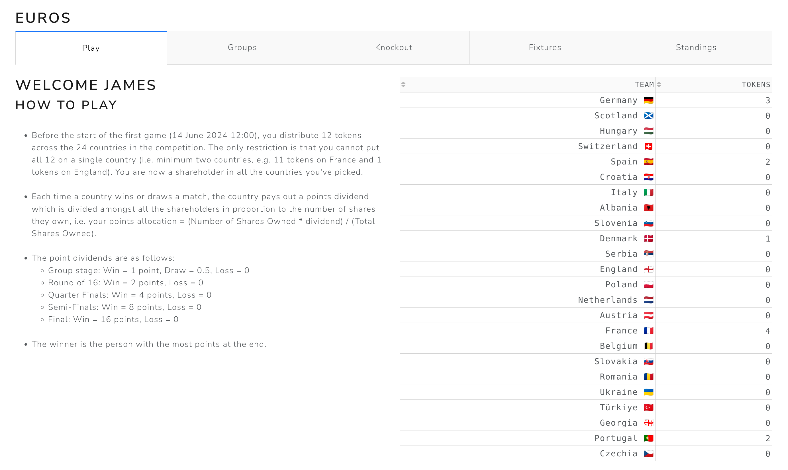

# Euros 2024 Fantasy


[](https://github.com/psf/black)
[](http://mypy-lang.org/)


This python application is for a Euros 2024 fantasy game where players accumulate points based on match results.
The application is created using Dash and Plotly for the frontend with most of the computation being handled by 
pandas. 
Rather than a database, the app uses files for storing the fixtures and the users' points. 
This is because, when we used this app for the game during the Euros, there were very few API calls from the website.
If one were to scale this app for many more users, this approach would need to be revisited.    
On the frontend, the app is designed to be responsive and mobile-friendly. 
Plotly does not create figures which are designed to be mobile-friendly. 
To overcome this, different figures are used for different screensizes through a combination of Plotly and Dash CSS. 

See the Rules below for a preview of the landing page of the app, or use the documentation below to get going! 
  


## Rules

<p float="center">
  <a></a>
</p>


## Setup

1) Requires a Python 3.12 environment (virtual environment recommended). 

2) Install all the dependencies
```
pip install -e ".[lint, test]"
```

3) Run locally (this will make the app available at `0.0.0.0:3000`)
```
python euros/main.py -f euros/tests/resources/test_config.yaml
``` 

4) Log in using a username/password combination from 
```
euros/tests/resources/example_base_path/example_group/users.json
```

5) Extra - run using `gunicorn`
```
gunicorn 'euros.main:server(filepath="euros/tests/resources/test_config.yaml")'
```
