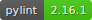

# Python Template


[](https://github.com/psf/black)




[](http://mypy-lang.org/)


## Prerequisites (MacOS)

1) Install [brew](https://brew.sh/):

   ```
   /bin/bash -c "$(curl -fsSL https://raw.githubusercontent.com/Homebrew/install/HEAD/install.sh)"
   ```

2) Install `pyenv` and `pyenv-virtualenv`:

    ```
   brew install pyenv pyenv-virtualenv
   ```
    
3) Add the following to your profile (`~/.zshrc` or equivalent). This ensures `pyenv` and `pyenv-virtualenv` load automatically:
   ```
   eval "$(pyenv init -)"
   eval "$(pyenv virtualenv-init -)"
   ```
   
4) Install `docker`:

   ```
   brew cask install docker
   ```
    
5) Install `make`:
    
   ```
   brew install make
   ```

## Setup

1) Ensure the python version you want to use is installed: `pyenv install 3.11.1`

2) Create your virtual environment: `pyenv virtualenv 3.11.1 template_python`

3) Modify Intellij to use your virtual environment:

    a) File -> Project Structure

    b) Project Structure -> New -> Python SDK

    c) Existing Environment

    d) `~/.pyenv/versions/template_python/bin/python`

    e) You can check this by opening the terminal and running `python --version`.
    You should see something similar to:
    
    ```   
    (template_python) ...$ python --version                                                                    
    Python 3.11.1
    ```

4) Run `make install`

## Deploy

### With Docker

To deploy using docker first build the application using `make build_docker` and then run using `make run_docker`. 
This will spin up and instance of the application in a docker container with endpoints available on port 8080.

### Without Docker

To run without docker, there are two methods.
1) `python template_python/main.py` - will run flask using a development server
2) `gunicorn -w 1 -b 0.0.0.0:8080 template_python.main:app` - will run flask on a server with 1 worker.

## Endpoints

With the application running (whether with or without docker), there is a sample endpoint called hello_world which
simply returns `Hello World!` as shown below.

```
(template_python) 
jamesday @ ~/personal-projects/template.python * main
 [5] → curl localhost:8080/hello_world
Hello World!
```
